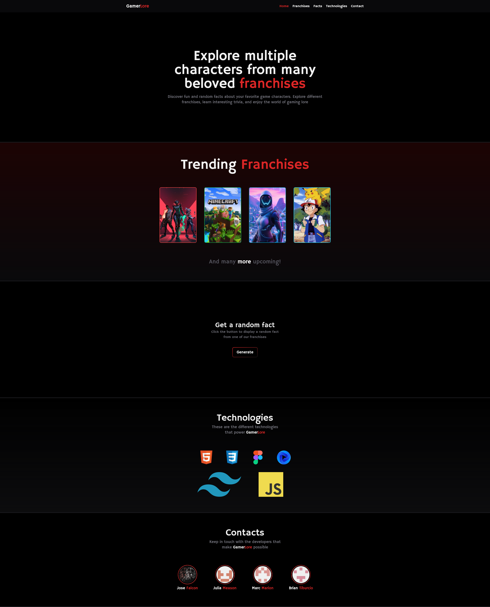
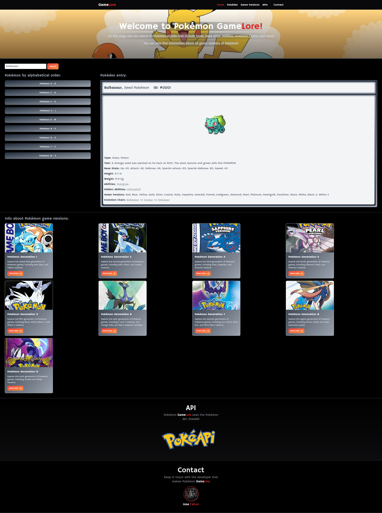
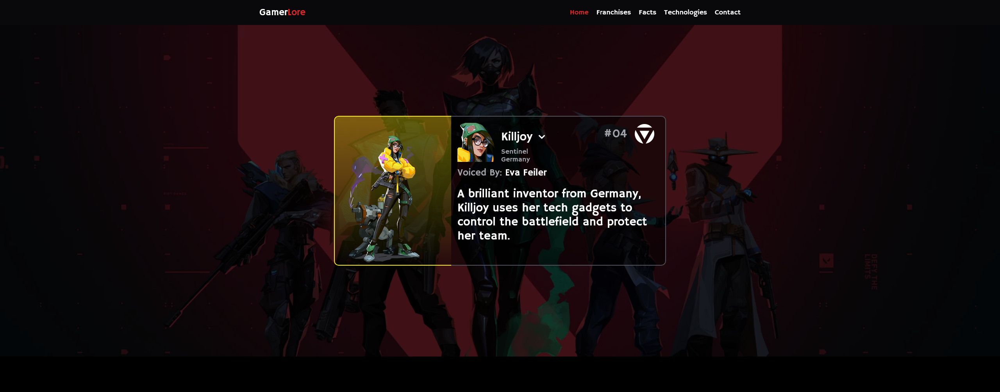
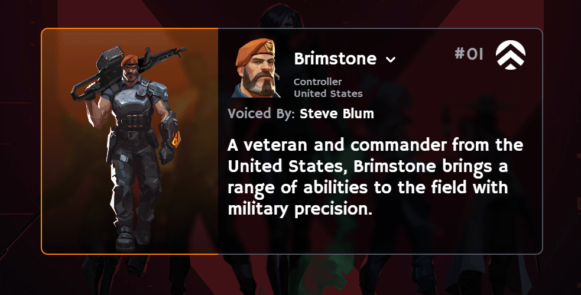
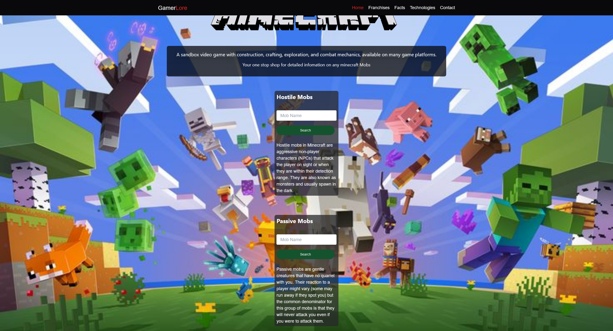

# GamerLore

## Description
GamerLore is a web application designed to provide fun and random facts about your favorite game characters. Whether you are a casual gamer or a hardcore fan, GamerLore offers a unique way to learn more about the characters you love from various games.

## Features
- Character Browsing: Explore a wide range of game characters from different titles and genres.

- Character Details: View detailed profiles and interesting facts about each character.
- Random Fact Generator: Get a random fact about a game character with just one click.

- Search and Filters: Easily find characters using the search bar or filter by game title, genre, and more.

- Responsive Design: Enjoy a seamless experience across all devices.

# Links
- [Github Repo URL](https://github.com/BrianTib/game-lore/)
- [Github Pages URL](https://briantib.github.io/game-lore/)

# Screenshots

